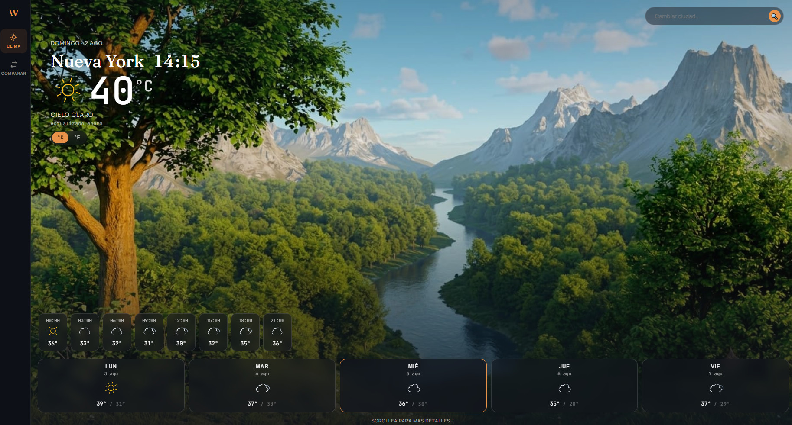
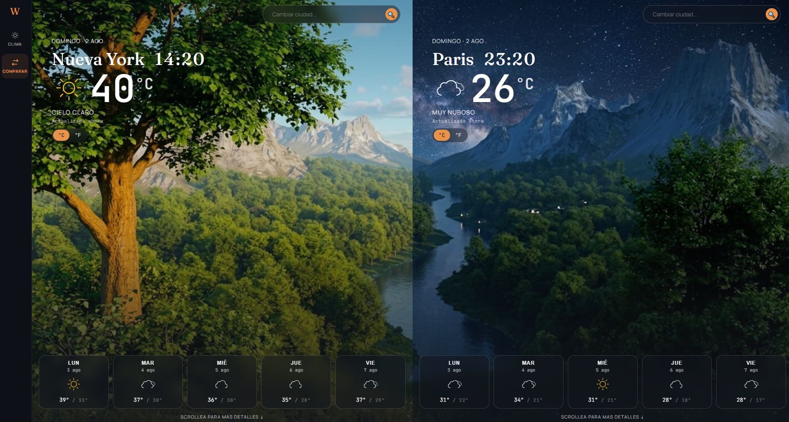
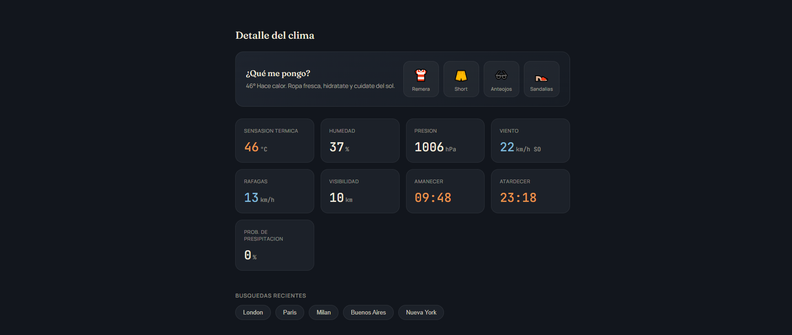
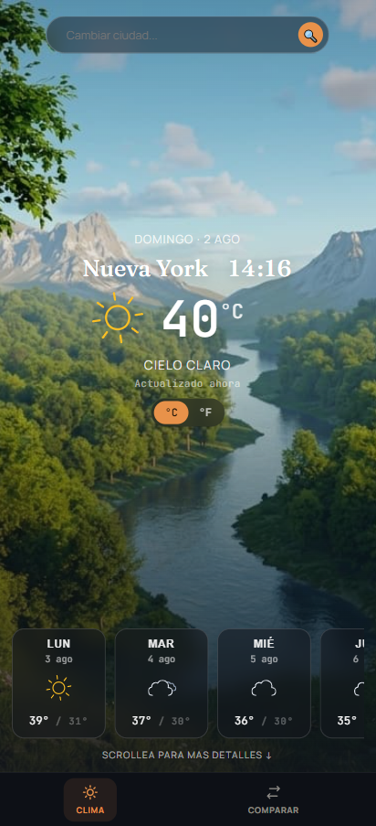

# Confy Weather

A weather app built with React that shows real-time weather data with dynamic visuals that adapt to the current conditions and time of day.

**[Live Demo →](https://wheater-enzo.netlify.app)**

---

## Screenshots



<br/>



<br/>

<table>
  <tr>
    <td></td>
    <td width="35%"></td>
  </tr>
</table>

---

## Features

- **Dynamic backgrounds** — season and hemisphere-aware imagery that switches between day and night versions based on the city's local time
- **Animated weather icons** — Meteocons icons matching each weather condition
- **Particle effects** — canvas-based rain, snow and fog rendered directly over the hero
- **City local time** — shows the actual current time in the searched city
- **5-day forecast** — expandable daily cards with hourly breakdown
- **Detailed stats** — feels like, humidity, pressure, wind direction, visibility, sunrise/sunset, precipitation probability
- **Outfit suggestion** — tells you what to wear based on the current conditions
- **Compare view** — search two cities side by side with a connected background and a stats comparison section including the distance between them
- **Search history** — recent searches saved to localStorage, clickable as chips
- **°C / °F toggle**
- **Fully responsive** — mobile bottom nav, desktop sidebar

---

## What I Learned

This project pushed me to solve problems I hadn't faced before:

- **Custom hooks** — built `useWeather` (parallel fetching of current weather + forecast), `useSearchHistory` (localStorage with functional state updates to avoid stale closures), and `useTimestamp` (elapsed time since last fetch using `Date.now`)
- **Canvas rendering** — implemented rain as a custom `requestAnimationFrame` loop drawing diagonal lines on a `<canvas>` element, with a `ResizeObserver` to keep it correctly sized across screen sizes
- **IntersectionObserver** — used to trigger scroll-based animations and countup number effects only when elements enter the viewport
- **City local time** — calculated from the UTC offset returned by the API (`timezone` field in seconds), independent of the user's browser timezone
- **Hemisphere detection** — the season background changes correctly for cities in the southern hemisphere (e.g. July is winter in Buenos Aires, summer in New York)
- **Haversine formula** — used to calculate the real-world distance in km between two cities in the compare view
- **Connected split-screen effect** — the compare view uses `background-position: left` and `background-position: right` on two panels sharing the same image, creating a seamless panorama effect
- **Git workflow** — worked with feature branches, pull requests and semantic commit messages throughout the whole project

---

## Tech Stack

- [React](https://react.dev/) + [Vite](https://vitejs.dev/)
- [OpenWeatherMap API](https://openweathermap.org/api) — current weather + 5-day forecast
- [Meteocons](https://bas.dev/work/meteocons) via `@iconify/react` — animated weather icons
- [tsParticles](https://particles.tsparticles.io/) — fog and snow effects

---

## Getting Started

### 1. Clone the repo

```bash
git clone https://github.com/EnzoSantoni/confy-weather-app.git
cd confy-weather-app
```

### 2. Install dependencies

```bash
npm install
```

### 3. Set up your API key

Create a `.env.local` file in the root of the project:

```
VITE_API_KEY=your_openweathermap_api_key
```

You can get a free API key at [openweathermap.org](https://openweathermap.org/api).

> **Note:** The API key will be visible in browser network requests since this is a frontend-only app with no backend. Keep that in mind if you deploy it publicly.

### 4. Run the dev server

```bash
npm run dev
```

---

## Author

**Enzo Santoni** — [LinkedIn](https://www.linkedin.com/in/enzo-santoni-757848222/) · [GitHub](https://github.com/EnzoSantoni) · [enzo.santoni.it@gmail.com](mailto:enzo.santoni.it@gmail.com)